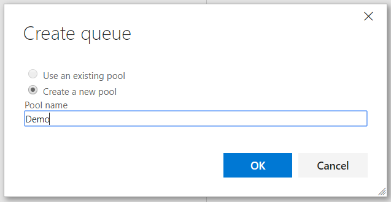

# DEMO IMPLEMENTATION

To be able to run this Demo, follow the instructions for the correct implementation of all the requeriments:

1. Create initial resources on Microsoft Azure.
2. Create a WebApp Service on Microsoft Azure.
3. Create a Windows VSTS Agent.
4. Create an Azure Service Endpoint on VSTS.
5. Import GitHub Repository to VSTS.
6. Import Build and Release definitions on VSTS.
7. Run the Demo.

**Take note that this guide has been created with Python 3.7.0, Powershell and Azure CLI installed.

## 1. Create initial resources on Microsoft Azure

To run successfully this Demo, it is needed three initial things:

1. Create an Application registered on Azure Active Directory.
2. Create a Service Principal for the Aplication.
3. Create a Resource Group to allocate on it all the necessary to run the demo.

To complete that you just have to run the Powershell script **CreateInitialResources.ps1** with the following parameters:

    SubscriptionId     --> Azure SubscriptionID to work on it
    ADApplicationName  --> Name for the Aplication to registrate on Azure Active Directory
    HomePage           --> Main page of the Application, normaly http://localhost
    ResourceGroupName  --> Name for the new Resource Group

Example:

```
CreateInitialResources.ps1 -SubscriptionId "{SubscriptionID}" -ADApplicationName "{ApplicationName}" -HomePage "http://localhost" -ResourceGroupName {ResourceGroupName}
```

During the execution of the script, the Azure login window will appear to perform the initial creation. This will not be necessary again when having an existing Service Principal.


The script is going to return an **IMPORTANT** information on yellow color at the end of the execution, copy it and save it.

(=250x100)

## 2. Create a WebApp Service on Microsoft Azure

Run the Powershell script **CreateWebAppService.ps1** with the following parameters regarding your Azure Service Principal and the Resource Group where you are going to allocate all the infrastructure for your Demo:

    TenantID            --> Azure Tenant ID of the Azure Subscription
    ServicePrincipalKey --> Existing service principal key
    ResourceGroup       --> Existing resource group

Example:

```
CreateWebAppService.ps1 -TenantID "{TenantID}" -ServicePrincipalKey "{ServicePrincipalKey}" -ResourceGroup "{ResorceGroupName}"
```

Now, you have your WebApp Service created on your Azure Resource Group with all needed configurations to run the Demo.

## 3. Create a Windows VSTS Agent

### VSTS Access Token creation

1. From your home page, open your profile. Go to your security details.

    

2. Create a personal access token.

    

3. Name your token. Select a lifespan for your token.

    If you have more than one account, you can also select the VSTS account where you want to use the token.

    

4. Select the scopes that this token will authorize for your specific tasks.

    In this section, select the option **Agent Pools (read, manage)**.

5. When you're done, make sure to copy the token. You'll use this token when you configure the agent.

    

### Powershell VM Creation and Agent Installation

1. VM Creation

    Download and install **.Net Framework 3.5** with Powershell

    ```
    Get-WindowsFeature NET-Framework-Features
    Install-WindowsFeature NET-Framework-Features
    ```

2. Agent Installation

    On the VM run the Powershell script VstsAgentInstall.ps1 with the following parameters:

        [Mandatory] vstsAccount          --> VSTS Account Name, not URL. http://{AccountName}.visualstudio.com
        [Mandatory] vstsUserPassword     --> VSTS Access Token
        [Mandatory] agentName            --> Name to register on VSTS
        agentNameSuffix                  --> Suffix for Agent name
        [Mandatory] poolName             --> Agent Pool to allocate new Agent
        [Mandatory] windowsLogonAccount  --> Local admin user
        [Mandatory] windowsLogonPassword --> Password of local admin user
        [Mandatory] driveLetter         --> Hard drive to allocate agent
        [Mandatory] workDirectory       --> Folder name to Agent Work Directory, typically _work
        [Mandatory] runMode             --> Agent Mode, "Service" recommended

    Example:

    ```
    VstsAgentInstall.ps1 -vstsAccount "{AccountNmae}" -vstsUserPassword "{VstsAccessToken}" -agentName "{AgentName}" -agentNameSuffix "{AgentNameSuffix}" -poolName "{PoolName}" -windowsLogonAccount "{UserAdmin}" -windowsLogonPassword "{UserAdminPassword}" -driveLetter "{HardDriveLetter}" -workDirectory "{AgentWorkDirectory}" -runMode "Service"
    ```

    The new Agent is up and running. The Agent appears on green status on the Agent Queue on VSTS.

### Manual VM Creation and Agent Installation

Create an Azure VM with Windows Server 2016, B2s size and install the following on it:

1. Download and install **.Net Framework 3.5**, download the installer .exe from Microsoft Download Center

    [Download .Net Framework 3.5](https://www.microsoft.com/en-us/download/details.aspx?id=21)

2. Download and install the **Java JDK** latest version

   [Download Java JDK](http://www.oracle.com/technetwork/java/javase/downloads/index.html)
 
    1. Configure the **JAVA_HOME** variable, with **Environment Variables** tool.
    Open **Control Panel >> System and Security >> System**, click on **Advanced system settings** and then click on **Environment Variables**. On **System variables** section, add **JAVA_HOME**.

        Example:

            Variable: JAVA_HOME
            Value: C:\Program Files\Java\jdk1.7.0_65 

    2. Test configuration runing `java -version` on cmd.

3. Download and install the **Java JRE** latest version

    [Download Java JRE](http://www.oracle.com/technetwork/java/javase/downloads/index.html)

    1. Configure the **JRE_HOME** variable, with **Environment Variables** tool.
    Open **Control Panel >> System and Security >> System**, click on **Advanced system settings** and then click on **Environment Variables**. On **System variables** section, add **JRE_HOME**.

        Example:

            Variable: JRE_HOME
            Value: C:\Program Files\Java\jre-10.0.1

    2. Test configuration runing `java -version` on cmd.

4. Download **Maven** latest version, for example **apache-maven-3.5.-bin.zip**

    [Download Apache Maven](http://maven.apache.org/download.cgi)

    1. Unzip it to the folder **C:\java\maven**.

    2. Configure the **M2_HOME** and **MAVEN_HOME** variables, with **Environment Variables** tool.
    Open **Control Panel >> System and Security >> System**, click on **Advanced system settings** and then click on **Environment Variables**. On **System variables** section, add **M2_HOME** and **MAVEN_HOME**.

        Example:

            Variable: M2_HOME
            Value: C:\java\maven\apache-maven-3.5.4\bin

            Variable: MAVEN_HOME
            Value: C:\java\maven\apache-maven-3.5.4\bin

    3. Test configuration runing `maven -version` on cmd.

5. Download and install VSTS Agent

    1. Inside the VM, open a browser, sign on to VSTS, and navigate to the Agent pools tab.

        

    2. Create a New Queue.

        

    3. Click on **Download Agent** and download the Windows Agent Installer.

        

    4. Create the following directory and unzip the installer there.

            C:\Agent

    5. Open the **Command Prompt (CMD)** as Administrator, naviate to **C:\Agent**. Run the **config.cmd**.

            .\config.cmd

    6. The installer going to the make a several questions, these are the answers:

        QUESTION  | ANSWER
        ------------- | -------------
        Enter Server URL  | https://{accountName}.visualstudio.com/
        Enter authentication type | Press {ENTER}
        Enter personal access token | VSTS Access Token
        Enter agent pool | Existing Agent Pool
        Enter agent name | Representative name
        Enter work folder | Press {ENTER}
        Enter run agent as service? (Y/N) | Y
        User account | Local Admin account

        The new Agent is up and running. The Agent appears on green status on the Agent Queue on VSTS.

## 4. Create an Azure Service Endpoint on VSTS

First, you have to create an Access Token on your VSTS instance.

1. From your VSTS home page, open your profile. Go to your security details.

    

2. Create a personal access token.

    

3. Name your token. Select a lifespan for your token.

    If you have more than one account, you can also select the VSTS account where you want to use the token.

    

4. Select the scopes that this token will authorize for your specific tasks.

    In this section, select the option **Service Endpoints (read, query and manage)**.

5. When you're done, make sure to copy the token. You'll use this token as your password.

    

Now you are available to create a Service Endpoint on VSTS.

Run the Python script **CreateAzureServiceEndpoint.py** with the following parameters regarding your VSTS Instance where your are going to configure your Demo and your Azure Account:

    vsts_intance          --> URL of VSTS http://{AccountName}.visualstudio.com
    project_name          --> VSTS Project
    subscription_id       --> Azure Subscription ID
    subscription_name     --> Azure Subscription Name
    tenant_id             --> Azure Tenant ID of the Azure Subscription
    service_principal_id  --> Existing Service Principal ID
    service_principal_key --> Existing Service Principal Key
    endpoint_name         --> Name for new Service Endpoint
    vsts_token            --> Existing VSTS Token

Example:

```
CreateAzureServiceEndpoint.py "https://{AccountName}.visualstudio.com" "{ProjectName}" "{AzureSubscriptionID}" "{AzureSubscriptionName}" "{AzureTenantID}" "{AzureServicePrincipalID}" "{AzureServicePrincipalKey}" "{EndpointName}" "{VSTSToken}"
```

After creation, you need to verify the endpoint.

1. Open the Services page from the "settings" icon in the top menu bar.

    

2. Select the Service Endpoint, click on **Update Service Configuration**, appears all the Endpoint description. Click on **Verify connection**, (should show a successful message), then click on **OK**.

    

Your Service Endpoint is ready.

## 5. Import GitHub Repository to VSTS

To run the CI/CD process, you need to import the code before configure the Build and Release.

1. On VSTS move to your Team page.

    From the repo drop-down, select **Import repository**.

    

2. Enter the GitHub URL to clone, in this case https://github.com/OscarEEC249/JavaSample.git (this no need Authorization), click on **Import**.

## 6. Import Build and Release definitions on VSTS

### Import Build definition

1. On VSTS move to your Team page. On top Menu, click on **Build and Release** option.

2. Move to **Builds** section and **Import** the **Demo-JavaSample-Build.json** file.

    

3. On the **Process** section, change the Build name to **Demo-JavaSample**.

    Select the Queue where the VSTS Agent was allocated.

    

4. On the **Get sources** section, select the repository imported.

    

5. Save Build definition.

    

### Import Release definition

1. On VSTS move to your Team page. On top Menu, click on **Build and Release** option.

2. Move to **Releases** section and **Import** the **Demo-JavaSample-Build.json** file.

    

3. Change Release name to **Demo-JavaSample**.

    

4. Move to **Task** manu. On **Demo Environment** section, select the AzureEndpoint, the AppType (Web App) and the WebApp Service name.

    

5. On **Run on agent** section, select the Queue where the VSTS Agent was allocated.

    

6. Repeat step 4 on the **Stop Azure App Service: javademo** step and on **Start Azure App Service: javademo** step.

## 7. Run the Demo

1. On VSTS move to your Team page. On top Menu, click on **Build and Release** option.

2. Move to **Builds** section, open the **Demo-JavaSample** build and click on **Queue new build..**.

    

3. Go to **Agent Queues** page, your build is running, when finish the Relese going to perform the deploy to your WebApp Service on Azure.

4. On a Web Browser, navigatge to https://{WebbAppServiceName}.azurewebsites.net/demomave to verify the results.
