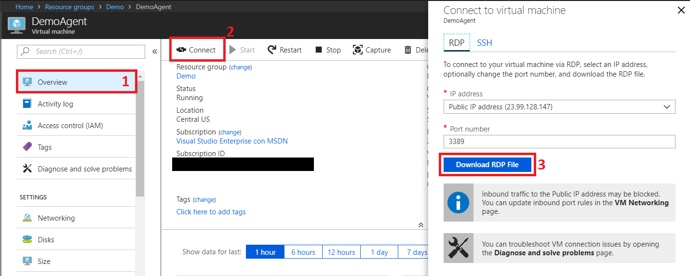

DEMO IMPLEMENTATION
=============================
## Version 1.0.0 - Updated July-10-2018

## Content

To be able to run this Demo, follow the instructions for the correct implementation of all the requeriments:

1. [Create VSTS Tokens.](#create-vsts-tokens)
2. Create Azure Resources

    This guide has two ways to create all the necessary Azure Resources for the Demo:
    1. [Script Resources Creation](#script-resources-creation)
        1. [Create Agent Pool on VSTS.](##1.-create-agent-pool-on-vsts)
        2. [Create initial resources on Microsoft Azure.](##2.-create-initial-resources-on-microsoft-azure)
        3. [Create an Azure Service Endpoint on VSTS.](##3.-create-an-azure-service-endpoint-on-vsts)
        4. [Extra Installations.](#extra-installations)
    1. [Manual Resources Creation](#manual-resources-creation)
        1. [Create Agent Pool on VSTS.](##1.-create-agent-pool-on-vsts)
        2. [Create initial resources on Microsoft Azure.*](##2.-create-initial-resources-on-microsoft-azure)
        3. [Create an Azure Service Endpoint on VSTS.*](##3.-create-an-azure-service-endpoint-on-vsts)
        4. [Extra Installations.](#extra-installations)

3. Complete the CI/CD on VSTS.

    1. [Import GitHub Repository to VSTS.](#import-github-repository-to-vsts)
    2. [Import Build and Release definitions on VSTS.](#import-build-and-release-definitions-on-vsts)
    3. [Run the Demo.](#run-the-demo)

**Take note that this guide has been created with Python 3.7.0, Powershell and Azure CLI installed.

## Create VSTS Tokens

It is neccesarry to create two types of tokens, one for **VSTS Agent** installation and other for **ServiceEnpoints** configuration

1. From your home page on VSTS, open your profile. Go to your security details.

    

2. Create a personal access token.

    

3. Name your token. Select a lifespan for your token.

    If you have more than one account, you can also select the VSTS account where you want to use the token.

    

4. Select the scopes that this token will authorize for your specific tasks.

    In this section select the option **Agent Pools (read, manage)** for **VSTS Agent Installation**

    Create a second one with option **Service Endpoints (read, query and manage)** for **ServiceEndpoint Configuration**.

5. When you're done, make sure to copy the tokens. You'll use them when you configure the **Agent** and **ServiceEndpoint**.

    

## Script Resources Creation

### 1. Create Agent Pool on VSTS

Run the Python script **CreateAgentPool.py** with the following parameters regarding your VSTS Instance where your are going to configure your Demo::

    vsts_intance    --> URL of VSTS http://{AccountName}.visualstudio.com
    agentpool_name  --> Name of the new Agent Pool to create
    vsts_token      --> VSTS Token for Service Endpoint

Example:

```
CreateAzureServiceEndpoint.py "https://{AccountName}.visualstudio.com" "{PoolName}" "{VSTSToken}"
```

The Agent Pool is ready.

### 2. Create initial resources on Microsoft Azure

To run successfully this Demo, it is needed six initial things:

1. An Application registered on Azure Active Directory.
2. A Service Principal for the Aplication.
3. A Resource Group to allocate on it all the necessary to run the demo.
4. A Stora Account on the Resource Group.
5. A Windows Server VM with .Net Framework 3.5 and the VSTS Agent installed and allocated on the Resource Group.
6. A WebApp Service to allocate the Demo Application.

To complete this tasks you just have to run the Powershell script **CreateInitialResources.ps1** with the following parameters:

    SubscriptionId           --> Azure SubscriptionID to work on it
    ADApplicationName        --> Name for the Aplication to registrate on Azure Active Directory
    HomePageOfADApplication  --> Main page of the Application, normaly http://localhost
    ResourceGroupName        --> Name for the new Resource Group
    VmName                   --> Name for the new Virtual Machine
    VmAdminUser              --> Name of the UserAdmin of the VM
    VmAdminPassword          --> Strong password for the UserAdmin of the VM
    VstsAgentToken           --> Token created for Agent installation
    VstsAccount              --> Name of the VSTS account to allocate the Demo.  Do not send the complete URL, just the AccountName section on the URL https://{AccountName}.visualstudio.com
    VstsAgentPool            --> Agent Pool on VSTS to allocate the VSTS Agent.
    AzureWebAppServiceName   --> Name of the new WebApp Service to allocate the application.

Example:

```
CreateInitialResources.ps1 -SubscriptionId "{SubscriptionID}" -ADApplicationName "{ApplicationName}" -HomePageOfADApplication "http://localhost" -ResourceGroupName "{ResourceGroupName}" -VmName "{VmName}" -VmAdminUser "{AdminUser}" -VmAdminPassword "{AdminPassword}" -VstsAgentToken "{VstsToken}" -VstsAgentPool "{VstsPoolName}" -AzureWebAppServiceName "{WebAppServiceNmae}"
```

During the execution of the script, the Azure Login window will appear to perform the initial creation. This will not be necessary again when having an existing Service Principal.


The script is going to return an **IMPORTANT** information on yellow color at the end of the execution, copy it and save it.


***The script is going to take several minutes to complete all the tasks.

### 3. Create an Azure Service Endpoint on VSTS

Run the Python script **CreateAzureServiceEndpoint.py** with the following parameters regarding your VSTS Instance where your are going to configure your Demo and your Azure Account:

    vsts_intance          --> URL of VSTS http://{AccountName}.visualstudio.com
    project_name          --> VSTS Project
    subscription_id       --> Azure Subscription ID
    subscription_name     --> Azure Subscription Name
    tenant_id             --> Azure Tenant ID of the Azure Subscription
    service_principal_id  --> Existing Service Principal ID
    service_principal_key --> Existing Service Principal Key
    endpoint_name         --> Name for new Service Endpoint
    vsts_token            --> VSTS Token for Service Endpoint

Example:

```
CreateAzureServiceEndpoint.py "https://{AccountName}.visualstudio.com" "{ProjectName}" "{AzureSubscriptionID}" "{AzureSubscriptionName}" "{AzureTenantID}" "{AzureServicePrincipalID}" "{AzureServicePrincipalKey}" "{EndpointName}" "{VSTSToken}"
```

After creation, you need to verify the endpoint.

1. Open the Services page from the "settings" icon in the top menu bar.

    

2. Select the Service Endpoint, click on **Update Service Configuration**, appears all the Endpoint description. Click on **Verify connection**, (should show a successful message), then click on **OK**.

    

Your Service Endpoint is ready.

## Manual Resources Creation

### 1. Create Agent Pool on VSTS

1. On VSTS navigate to **Agent Queues** page.

    

2. Create a New Queue.

    

### 2. Create initial resources on Microsoft Azure

To run successfully this Demo, it is needed six initial things:

1. Application registered on Azure Active Directory with Service Principal key.

    1. On your Azure Home Page, navigate to **Azure Active Directory** on your left panel.

        
    
    2. Inside the Active Directory, open **App Registration**.

        
    
    3. Click on **New Application Registration** and enter the following parameters:

        Name         --> Name to new AD Application.
        Type         --> Web app / API
        Sign-on URL  --> http://localhost
    
    4. Save the App ID, this is going to be your **Serve Principal ID**.

        

    5. On the App Created, click on **Setting** and then on **Keys**.

        

    6. Create a new key, click on save and copy the encripted key. This is going to be your **Service Principal Key**.

        

2. Resource Group to allocate on it all the necessary to run the demo.
    1. On your Azure Home Page, navigate to **Resource Groups** on your left panel.

        

    2. Create a new Resource Group.

    3. Add Active Directory Application to Resource Group.

        Inside the new Resource Group go to **Access control (IAM)**.

        

        Click on **Add** button, assign **Contributor** role and search de Active Directory Application by name.

        

        Click on **Save** button.

        The Resource Group is ready.

3. Storage Account on the Resource Group.

    1. Inside the new Resource Group, click on **Add** button and search for **Storages Account**.

        

    2. Create new Storage Account with following parameters:

            Name                     --> Storage Account name
            Account kind             --> Storage (general purpose v1)
            Location                 --> Same of your Resource Group
            Replication              --> Default value
            Performance              --> Default value
            Secure transfer required --> default value
            Resource Group           --> Resource Group recently created.
            Virtual Network          --> Default value

4. Windows Server VM with .Net Framework 3.5 and the VSTS Agent installed and allocated on the Resource Group.

    1. Create Windows Server on Azure.

        1. Inside the new Resource Group, click on **Add** button and search for **Virtual Machines** section and select **Windows Server**.

            

        2. Select **Windows Server 2016 Datacenter** and click on **Create** to start the configuration.

        3. Basics Configurations

            Enter the following parameters and then click on **OK**:

                Name            --> VM Name
                VM disk type    --> SSD
                Username        --> Admin user for VM
                Password        --> Admin password for VM
                Subscription    --> Default value
                Resource Group  --> Resource Group recently created
                Location        --> Same of your Resource

            

        4. Size Configurations.

            Search and select **B2s** type, then click on **Select**.

            

        5. Settings Configurations.

            Enter the following parameters:

                Availability zone --> Default value
                Availability set  --> None

            Create new Network.

            

                Select public inbound ports  --> HTTP, HTTPS, SSH, RDP
                Diagnostics storage account  --> Storage account recently created

            Click on **OK**.

        6. Summary configuration.

            Click on **Create**. This will take several minutes.

        7. Download RDP file to crate remote session.

            

    2. Download and install .Net Framework and VSTS Agent.

        Create a remote session to your VM and follow the steps:
        1. Download and install **.Net Framework 3.5**

            Download the installer .exe from Microsoft Download Center and install the Framework.

            [Download .Net Framework 3.5](https://www.microsoft.com/en-us/download/details.aspx?id=21)

        2. Download and install VSTS Agent

            1. Inside the VM, open a browser, sign in into VSTS, and navigate to **Agent Queues** page.

                

            2. Click on **Download Agent** and download the Windows Agent Installer.

                

            3. Create the following directory and unzip the installer there.

                    C:\Agent

            4. Open the **Command Prompt (CMD)** as Administrator, naviate to **C:\Agent**and then run the **config.cmd**.

                    .\config.cmd

            5. The installer is going to the make a several questions:

                QUESTION  | ANSWER
                ------------- | -------------
                Enter Server URL  | https://{accountName}.visualstudio.com/
                Enter authentication type | Press [ENTER]
                Enter personal access token | VSTS Access Token
                Enter agent pool | Existing Agent Pool
                Enter agent name | Representative name
                Enter work folder | Press {ENTER}
                Enter run agent as service? (Y/N) | Y
                User account | Local Admin account

                The new Agent is up and running. The Agent appears on green status on the Agent Queue on VSTS.

5. WebApp Service to allocate the Demo Application.

    1. Inside the new Resource Group, click on **Add** button and search for **Web** section and select **Web App Microsoft**.

        

    2. Click on **Create** button and enter the following parameters:

            App name          --> Name of new WebApp Service
            Subscription      --> Default value
            Resource Group    --> Resource Group recently created
            OS                --> Windows
            App Service Plan  --> Default value

    3. Click on **Create** button and then open the new WebbApp.

    4. Go into **Application settings** on the WebApp.

        

    5. On **General Settings** select the following:

            Java version        --> Java 8
            Java minor version  --> Newest
            Java web container  --> Newest Tomcast 8.0
            HTTP Version        --> 2.0

    6. Save the changes.

    The new WebApp is ready.

### 3. Create an Azure Service Endpoint on VSTS

1. Open the Services page from the "settings" icon in the top menu bar.

    

2. Click on **New Service Endpoint** and select **Azure Resource Manager** option.

    Click on **Use the full version of the endpoint dialog** and enter the following parameters regarding your Azure Account:

        Connection Name              --> New service endpoint name
        Environment                  --> Azure Cloud
        Subscription ID              --> Azure Subscription ID
        Subscription Name            --> Azure Subscription Name
        Service Principal Client ID  --> Service Principal ID recently created
        Service Principal Key        --> Service Princiapl Key recently created
        Tenant ID                    --> Tenant ID of Azure Subscription

3. Click on **Verify connection**, (should show a successful message), then click on **OK**.

    

Your Service Endpoint is ready.

## Extra Installations

On the VM created for the VSTS Agent, install the following programs:

1. Download and install the **Java JDK** latest version

   [Download Java JDK](http://www.oracle.com/technetwork/java/javase/downloads/index.html)
 
    1. Configure the **JAVA_HOME** variable, with **Environment Variables** tool.
    Open **Control Panel >> System and Security >> System**, click on **Advanced system settings** and then click on **Environment Variables**. On **System variables** section, add **JAVA_HOME**.

        Example:

            Variable: JAVA_HOME
            Value: C:\Program Files\Java\jdk1.7.0_65 

    2. Test configuration runing `java -version` on cmd.

2. Download and install the **Java JRE** latest version

    [Download Java JRE](http://www.oracle.com/technetwork/java/javase/downloads/index.html)

    1. Configure the **JRE_HOME** variable, with **Environment Variables** tool.
    Open **Control Panel >> System and Security >> System**, click on **Advanced system settings** and then click on **Environment Variables**. On **System variables** section, add **JRE_HOME**.

        Example:

            Variable: JRE_HOME
            Value: C:\Program Files\Java\jre-10.0.1

    2. Test configuration runing `java -version` on cmd.

3. Download **Maven** latest version, for example **apache-maven-3.5.-bin.zip**

    [Download Apache Maven](http://maven.apache.org/download.cgi)

    1. Unzip it to the folder **C:\java\maven**.

    2. Configure the **M2_HOME** and **MAVEN_HOME** variables, with **Environment Variables** tool.
    Open **Control Panel >> System and Security >> System**, click on **Advanced system settings** and then click on **Environment Variables**. On **System variables** section, add **M2_HOME** and **MAVEN_HOME**.

        Example:

            Variable: M2_HOME
            Value: C:\java\maven\apache-maven-3.5.4\bin

            Variable: MAVEN_HOME
            Value: C:\java\maven\apache-maven-3.5.4\bin

    3. Test configuration runing `maven -version` on cmd.

## Import GitHub Repository to VSTS

To run the CI/CD process, you need to import the code before configure the Build and Release.

1. On VSTS move to your Team page.

    From the repo drop-down, select **Import repository**.

    

2. Enter the GitHub URL to clone, in this case https://github.com/OscarEEC249/JavaSample.git (this no need Authorization), click on **Import**.

## Import Build and Release definitions on VSTS.

### Import Build definition

1. On VSTS move to your Team page. On top Menu, click on **Build and Release** option.

2. Move to **Builds** section and **Import** the **Demo-JavaSample-Build.json** file.

    

3. On the **Process** section, change the Build name to **Demo-JavaSample**.

    Select the Queue where the VSTS Agent was allocated.

    

4. On the **Get sources** section, select the repository imported.

    

5. Save Build definition.

    

### Import Release definition

1. On VSTS move to your Team page. On top Menu, click on **Build and Release** option.

2. Move to **Releases** section and **Import** the **Demo-JavaSample-Build.json** file.

    

3. Change Release name to **Demo-JavaSample**.

    

4. Move to **Task** manu. On **Demo Environment** section, select the AzureEndpoint, the AppType (Web App) and the WebApp Service name.

    

5. On **Run on agent** section, select the Queue where the VSTS Agent was allocated.

    

6. Repeat step 4 on the **Stop Azure App Service: javademo** step and on **Start Azure App Service: javademo** step.

## Run the Demo

1. On VSTS move to your Team page. On top Menu, click on **Build and Release** option.

2. Move to **Builds** section, open the **Demo-JavaSample** build and click on **Queue new build..**.

    

3. Go to **Agent Queues** page, your build is running, when finish the Relese going to perform the deploy to your WebApp Service on Azure.

4. On a Web Browser, navigatge to **https://{WebbAppServiceName}.azurewebsites.net/demomaven** to verify the results.
